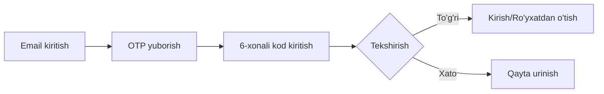

# 📄 Texnik Vazifa (TZ) — CyberPitch: Mobile Football League

## 📋 Loyiha Ma'lumotlari

| Parameter | Qiymat |
|-----------|--------|
| **Loyiha Nomi** | CyberPitch |
| **Versiya** | 1.0 |
| **Platforma** | Android & iOS (Flutter) |
| **Backend** | Python (FastAPI / Django) |
| **Holati** | Ishlab chiqish bosqichida |
| **Til Ko'magi** | O'zbek 🇺🇿, Rus 🇷🇺, Ingliz 🇬🇧 |

---

## 1. 🎯 Loyiha Haqida Umumiy Ma'lumot

### 1.1 Tavsif
**CyberPitch** — bu eFootball (PES) Mobile o'yini ixlosmandlari uchun maxsus ishlab chiqilgan kiber-sport platformasi. Ilova foydalanuvchilarga onlayn turnirlarda qatnashish, o'z jamoasini (klanini) tuzish, statistikalarni kuzatib borish va reytingda ko'tarilish imkonini beradi.

### 1.2 Asosiy Maqsad
O'zbekiston va Markaziy Osiyo mintaqasidagi PES o'yinchilari uchun markazlashgan, adolatli va avtomatlashtirilgan turnir tizimini yaratish.

### 1.3 Maqsadli Auditoriya
- **Yosh:** 13-35 yosh
- **Gender:** Erkak va ayollar (asosan erkaklar ~85%)
- **Mintaqa:** O'zbekiston, Qozog'iston, Qirg'iziston
- **O'yin tajribasi:** Boshlang'ich darajadan professional darajagacha

---

## 2. 🏗️ Texnik Arxitektura Talablari

### 2.1 Mobil Ilova (Client)

| Komponent | Texnologiya |
|-----------|------------|
| **Framework** | Flutter 3.19+ |
| **Arxitektura** | Clean Architecture + Feature-First (Modulli tizim) |
| **State Management** | BLoC Pattern |
| **Navigation** | Go Router |
| **Dizayn Tizimi** | Faqat "Dark Mode" (Tungi rejim) |
| **Lokalizatsiya** | Easy Localization |
| **Min SDK** | Android 21 (5.0), iOS 15.0 |

### 2.2 Server (Backend)

| Komponent | Texnologiya |
|-----------|------------|
| **Til** | Python 3.11+ |
| **Framework** | FastAPI / Django REST |
| **Database** | PostgreSQL 15+ |
| **Cache** | Redis |
| **API** | REST API (JSON formati) |
| **Real-time** | WebSockets |
| **Xavfsizlik** | JWT (Access & Refresh Tokens) |

### 2.3 Infrastructure

```yaml
Infrastructure:
  Hosting: AWS / Google Cloud
  Storage: S3 / Cloud Storage
  CDN: CloudFlare
  Monitoring: Prometheus + Grafana
  Logging: ELK Stack
  CI/CD: GitLab CI / GitHub Actions
  Container: Docker + Kubernetes
```

---

## 3. 🎨 Dizayn va UI/UX Talablari

### 3.1 Ranglar Palitrasi

| Rang Turi | Hex Kodi | Qo'llanishi |
|-----------|----------|-------------|
| **Asosiy fon** | #0A0E1A | Dark Navy - Barcha screen foni |
| **Ikkinchi fon** | #1A1F2E | Card va panel fonlari |
| **Primary** | #6C5CE7 | Asosiy tugmalar, active elementlar |
| **Accent** | #00D9FF | Neon Cyan - Muhim elementlar |
| **Success** | #00FB94 | Muvaffaqiyat xabarlari |
| **Warning** | #FFB800 | Ogohlantirish |
| **Error** | #FF4757 | Xatolik xabarlari |

### 3.2 Tipografiya

```css
/* Sarlavhalar */
font-family: 'Orbitron', sans-serif;
font-weight: 700-900;
font-size: 24px-32px;

/* Asosiy matn */
font-family: 'Inter', sans-serif;
font-weight: 400-600;
font-size: 14px-18px;
```

### 3.3 Grafika Talablari

- ✅ Barcha ikonkalar `.svg` formatida
- ✅ Rasmlar WebP formatida optimizatsiya qilingan
- ✅ Lazy loading qo'llanilgan
- ✅ Offline cache mavjud

---

## 4. 📱 Funksional Talablar

### 4.1 🔐 Ro'yxatdan O'tish va Kirish (Auth)

#### 4.1.1 Email orqali kirish ✅



**Talablar:**
- ✅ Email orqali kirish (Resend service)
- ✅ 6 xonali Email OTP kodi
- ✅ Avtomatik sessiya saqlash (JWT tokens)
- ⏳ Biometric authentication (Touch ID/Face ID)

#### 4.1.2 Social Login (Opsional)

- Google Sign-In
- Discord OAuth
- Apple Sign-In (iOS uchun majburiy)

### 4.2 👤 Foydalanuvchi Profili ✅

#### Majburiy maydonlar:

| Maydon | Turi | Validatsiya | Status |
|--------|------|-------------|--------|
| **Nickname** | String | 3-20 belgi, unique | ✅ |
| **PES ID** | Number | Qat'iy 9 raqam | ✅ |
| **Team Strength** | Number | 1000-5000 oralig'ida | ✅ |
| **Avatar** | Image | Max 5MB, JPG/PNG | ✅ |
| **Region** | Select | Predefined list | ✅ |
| **Email** | String | Valid email format | ✅ |

#### Qo'shimcha maydonlar:

- ✅ Level & Experience system
- ✅ Coins balance
- ✅ Statistics dashboard (wins, losses, draws, win rate)
- ✅ Online status
- ⏳ Bio (160 belgi)
- ⏳ Social media links
- ⏳ Achievements showcase

### 4.3 🏆 Turnirlar Tizimi

#### 4.3.1 Turnir Turlari

| Turi | Tavsif | Davomiyligi | Status |
|------|--------|-------------|--------|
| **Quick Match** | 1v1 tezkor o'yin | 15-20 daqiqa | ✅ |
| **Challenge** | Do'stga challenge yuborish | 15-20 daqiqa | ✅ |
| **Daily Tournament** | Kunlik turnir, 16 ishtirokchi | 2-3 soat | ⏳ |
| **Weekly League** | Haftalik liga formati | 7 kun | ⏳ |
| **Championship** | Oylik chempionat | 30 kun | ⏳ |

#### 4.3.2 Turnir Holatlari

```typescript
enum TournamentStatus {
  UPCOMING = "Kelgusi",    // Ro'yxat ochiq
  REGISTRATION = "Ro'yxat", // Ro'yxatdan o'tish
  LIVE = "Jonli",          // O'yin ketmoqda
  COMPLETED = "Tugagan"    // Yakunlangan
}
```

#### 4.3.3 Bracket System

- Single Elimination
- Double Elimination
- Swiss System
- Round Robin

### 4.4 ⚽ O'yin Jarayoni

#### 4.4.1 Match Room

```javascript
MatchRoom = {
  id: "unique_id",
  tournament_id: "tournament_id",
  player1: {
    id: "user_id",
    pes_id: "123456789",
    team_strength: 3200
  },
  player2: {
    id: "user_id",
    pes_id: "987654321",
    team_strength: 3150
  },
  chat: enabled,
  status: "WAITING|PLAYING|DISPUTED|COMPLETED",
  start_time: timestamp,
  end_time: timestamp
}
```

#### 4.4.2 Natija Kiritish

1. **Oddiy holat:** Ikkala o'yinchi bir xil natija kiritadi → Avtomatik tasdiqlash
2. **Mojaro holati:** Har xil natija → Admin tekshiruvi
3. **Screenshot yuklash:** Majburiy, max 10MB
4. **Vaqt chegarasi:** O'yin tugaganidan 10 daqiqa ichida

### 4.4.3 Do'stlik Tizimi ✅

**Amalga oshirilgan funksiyalar:**
- ✅ O'yinchi qidirish (nickname bo'yicha)
- ✅ Do'stlik so'rovi yuborish
- ✅ Do'stlik so'rovini qabul qilish/rad etish
- ✅ Do'stlar ro'yxati
- ✅ O'yinchi profili ko'rish
- ✅ Online status ko'rsatish

### 4.4.4 Push Notifications ✅

**OneSignal integratsiyasi:**
- ✅ Challenge notification (custom sound)
- ✅ Do'stlik so'rovi notification (custom sound)
- ✅ Do'stlik qabul qilindi notification
- ✅ Real-time UI yangilanishi
- ✅ Notification click handling (to'g'ri sahifaga yo'naltirish)

### 4.5 👥 Jamoa (Klan) Tizimi

#### 4.5.1 Jamoa Yaratish

```yaml
Team:
  name: "Max 30 belgi"
  tag: "3-5 belgi, CAPS"
  description: "Max 500 belgi"
  logo: "SVG/PNG, max 2MB"
  max_members: 11
  requirements:
    min_team_strength: 2500
    min_level: 10
```

#### 4.5.2 Jamoa Rollari

| Roll | Huquqlar |
|------|----------|
| **Captain** | To'liq boshqaruv |
| **Co-Captain** | A'zolarni qo'shish/chiqarish |
| **Player** | Turnirlarda qatnashish |
| **Substitute** | Zaxira o'yinchi |

### 4.6 💬 Chat Sistema

- **Global Chat:** Barcha foydalanuvchilar uchun
- **Team Chat:** Jamoa a'zolari uchun
- **Match Chat:** O'yin vaqtida raqib bilan
- **Private Messages:** Shaxsiy xabarlar

**Moderatsiya:**
- Spam filter
- So'kinish filter (bad words)
- Report sistema
- Auto-ban for violations

### 4.7 🏅 Achievement & Ranking

#### Darajalar:

```python
levels = {
    "Bronze": {"min": 0, "max": 999},
    "Silver": {"min": 1000, "max": 2499},
    "Gold": {"min": 2500, "max": 4999},
    "Platinum": {"min": 5000, "max": 7499},
    "Diamond": {"min": 7500, "max": 9999},
    "Legend": {"min": 10000, "max": None}
}
```

#### Achievement Types:

- **First Win:** Birinchi g'alaba
- **Win Streak:** Ketma-ket g'alabalar
- **Tournament Champion:** Turnir g'olibi
- **Team Leader:** Jamoa yaratish
- **Veteran:** 100+ o'yin

### 4.8 💰 Virtual Currency & Shop

#### Currency Types:

| Valyuta | Olish usuli | Sarflash |
|---------|-------------|----------|
| **Coins** | O'yin g'alabalari | Turnir to'lovlari |
| **Gems** | Real pul | Premium features |
| **XP** | Har qanday faoliyat | Level up |

#### Shop Items:

- Avatar frames
- Team logos
- Chat stickers
- Tournament tickets
- XP boosters

---

## 5. 💾 Ma'lumotlar Bazasi Sxemasi

### 5.1 Asosiy Jadvallar

```sql
-- Users table
CREATE TABLE users (
    id UUID PRIMARY KEY,
    phone_number VARCHAR(20) UNIQUE NOT NULL,
    created_at TIMESTAMP DEFAULT NOW(),
    last_login TIMESTAMP,
    is_active BOOLEAN DEFAULT true,
    is_banned BOOLEAN DEFAULT false
);

-- Profiles table
CREATE TABLE profiles (
    id UUID PRIMARY KEY,
    user_id UUID REFERENCES users(id),
    nickname VARCHAR(30) UNIQUE NOT NULL,
    pes_id VARCHAR(9) NOT NULL,
    team_strength INTEGER CHECK (team_strength BETWEEN 1000 AND 5000),
    avatar_url TEXT,
    region VARCHAR(50),
    level INTEGER DEFAULT 1,
    experience INTEGER DEFAULT 0,
    coins INTEGER DEFAULT 100,
    gems INTEGER DEFAULT 0,
    created_at TIMESTAMP DEFAULT NOW()
);

-- Tournaments table
CREATE TABLE tournaments (
    id UUID PRIMARY KEY,
    title VARCHAR(100) NOT NULL,
    description TEXT,
    type VARCHAR(20) NOT NULL,
    status VARCHAR(20) NOT NULL,
    entry_fee INTEGER DEFAULT 0,
    prize_pool INTEGER DEFAULT 0,
    max_participants INTEGER NOT NULL,
    current_participants INTEGER DEFAULT 0,
    start_time TIMESTAMP NOT NULL,
    end_time TIMESTAMP,
    created_by UUID REFERENCES users(id),
    created_at TIMESTAMP DEFAULT NOW()
);

-- Matches table
CREATE TABLE matches (
    id UUID PRIMARY KEY,
    tournament_id UUID REFERENCES tournaments(id),
    player1_id UUID REFERENCES users(id),
    player2_id UUID REFERENCES users(id),
    player1_score INTEGER,
    player2_score INTEGER,
    winner_id UUID REFERENCES users(id),
    screenshot_url TEXT,
    status VARCHAR(20) NOT NULL,
    disputed BOOLEAN DEFAULT false,
    played_at TIMESTAMP,
    created_at TIMESTAMP DEFAULT NOW()
);

-- Teams table
CREATE TABLE teams (
    id UUID PRIMARY KEY,
    name VARCHAR(30) UNIQUE NOT NULL,
    tag VARCHAR(5) UNIQUE NOT NULL,
    description TEXT,
    logo_url TEXT,
    captain_id UUID REFERENCES users(id),
    max_members INTEGER DEFAULT 11,
    current_members INTEGER DEFAULT 1,
    created_at TIMESTAMP DEFAULT NOW()
);

-- Team Members
CREATE TABLE team_members (
    id UUID PRIMARY KEY,
    team_id UUID REFERENCES teams(id),
    user_id UUID REFERENCES users(id),
    role VARCHAR(20) NOT NULL,
    joined_at TIMESTAMP DEFAULT NOW(),
    UNIQUE(team_id, user_id)
);
```

### 5.2 Indexes

```sql
CREATE INDEX idx_users_phone ON users(phone_number);
CREATE INDEX idx_profiles_nickname ON profiles(nickname);
CREATE INDEX idx_profiles_pes_id ON profiles(pes_id);
CREATE INDEX idx_tournaments_status ON tournaments(status);
CREATE INDEX idx_matches_tournament ON matches(tournament_id);
CREATE INDEX idx_team_members_user ON team_members(user_id);
```

---

## 6. 🛡️ Admin Panel Talablari

### 6.1 Asosiy Funksiyalar

| Modul | Funksiyalar |
|-------|-------------|
| **Dashboard** | Statistika, grafiklar, real-time monitoring |
| **Users Management** | Ban/unban, profil tahrirlash, reset password |
| **Tournaments** | Yaratish, tahrirlash, bekor qilish |
| **Disputes** | Mojaro hal qilish, screenshot tekshirish |
| **Reports** | Shikoyatlarni ko'rish va hal qilish |
| **Analytics** | DAU/MAU, Revenue, Retention |
| **Push Notifications** | Ommaviy xabar yuborish |

### 6.2 Admin Rollari

```yaml
SuperAdmin:
  - Full access to all modules
  - System configuration
  - Admin management

Moderator:
  - User management
  - Dispute resolution
  - Reports handling

Support:
  - View-only access
  - Basic user support
  - Ticket management
```

### 6.3 Admin Panel Tech Stack

- **Frontend:** React + TypeScript
- **UI Library:** Ant Design / Material-UI
- **State Management:** Redux Toolkit
- **Charts:** Recharts / Chart.js

---

## 7. 🔒 Xavfsizlik Talablari

### 7.1 Authentication & Authorization

- JWT tokens (15 min access, 7 days refresh)
- Rate limiting (100 requests/minute)
- IP-based blocking for suspicious activity
- 2FA for admin accounts

### 7.2 Data Protection

```yaml
Encryption:
  - At Rest: AES-256
  - In Transit: TLS 1.3
  - Passwords: bcrypt (12 rounds)
  - Sensitive Data: Field-level encryption

Privacy:
  - GDPR compliance
  - Data anonymization
  - Right to deletion
  - Data portability
```

### 7.3 Security Measures

- [ ] SQL Injection prevention (parameterized queries)
- [ ] XSS protection (input sanitization)
- [ ] CSRF tokens
- [ ] API rate limiting
- [ ] DDoS protection (CloudFlare)
- [ ] Regular security audits
- [ ] Penetration testing (quarterly)

### 7.4 Device Security

```javascript
DeviceSecurity = {
  deviceFingerprint: true,
  maxDevicesPerAccount: 2,
  jailbreakDetection: true,
  certificatePinning: true,
  obfuscation: true
}
```

---

## 8. 🌐 Lokalizatsiya

### 8.1 Qo'llab-quvvatlanadigan tillar

| Til | Kod | Status | Coverage |
|-----|-----|--------|----------|
| O'zbek | uz-UZ | Default | 100% |
| Русский | ru-RU | Required | 100% |
| English | en-US | Required | 100% |
| Қазақ | kk-KZ | Planned | 0% |
| Кыргыз | ky-KG | Planned | 0% |

### 8.2 Lokalizatsiya Qoidalari

```dart
// Auto-detection logic
String getDeviceLanguage() {
  final locale = Platform.localeName;
  
  if (locale.startsWith('uz')) return 'uz-UZ';
  if (locale.startsWith('ru')) return 'ru-RU';
  if (locale.startsWith('en')) return 'en-US';
  
  return 'uz-UZ'; // Default
}
```

### 8.3 Translation Management

- Use translation keys, not hardcoded strings
- Plural forms support
- Date/time formatting per locale
- Number formatting per locale
- RTL support ready (future)

---

## 9. 📊 Performance Requirements

### 9.1 Mobile App Performance

| Metrika | Maqsad | Kritik |
|---------|--------|--------|
| **App Launch** | < 2s | < 3s |
| **Screen Load** | < 0.5s | < 1s |
| **API Response** | < 1s | < 2s |
| **FPS** | 60 fps | 30 fps |
| **Memory Usage** | < 150MB | < 200MB |
| **Battery Drain** | < 5%/hour | < 8%/hour |
| **Offline Mode** | Full UI | Core features |

### 9.2 Backend Performance

```yaml
API Performance:
  - Response Time: p50 < 100ms, p95 < 500ms, p99 < 1s
  - Throughput: 10,000 requests/second
  - Concurrent Users: 100,000+
  - Database Queries: < 50ms
  - Cache Hit Ratio: > 90%

Scalability:
  - Horizontal scaling with Kubernetes
  - Auto-scaling based on CPU/Memory
  - Database read replicas
  - CDN for static assets
```

### 9.3 Network Optimization

- API response compression (gzip)
- Image optimization (WebP, lazy loading)
- Request batching
- Offline-first architecture
- Progressive data loading

---

## 10. 💳 Monetizatsiya Strategiyasi

### 10.1 Revenue Streams

| Model | Tavsif | Revenue Share |
|-------|--------|---------------|
| **Tournament Entry Fees** | Pullik turnirlar | 70% prize, 30% platform |
| **Premium Subscription** | Oylik obuna | $4.99/oy |
| **In-App Purchases** | Gems, boosts | Variable |
| **Ads** | Rewarded video ads | Per impression |
| **Sponsorship** | Brand tournaments | Custom deals |

### 10.2 Premium Features

```yaml
Premium Subscription ($4.99/month):
  - Ad-free experience
  - Unlimited tournament entries
  - Advanced statistics
  - Custom avatar frames
  - Priority matchmaking
  - Exclusive tournaments
  - 2x XP boost
  - Special chat badge
```

### 10.3 Payment Integration

- **Local:** Click, Payme, Uzum Bank
- **International:** Stripe, PayPal
- **Crypto:** USDT (optional)
- **Mobile:** Google Pay, Apple Pay

---

## 11. 📈 Analytics & Monitoring

### 11.1 Key Metrics (KPIs)

```python
kpis = {
    "user_metrics": [
        "DAU (Daily Active Users)",
        "MAU (Monthly Active Users)",
        "Retention Rate (D1, D7, D30)",
        "Churn Rate",
        "Session Duration",
        "Sessions per User"
    ],
    "business_metrics": [
        "ARPU (Average Revenue Per User)",
        "LTV (Lifetime Value)",
        "CAC (Customer Acquisition Cost)",
        "Conversion Rate",
        "Tournament Participation Rate"
    ],
    "technical_metrics": [
        "Crash Rate",
        "API Latency",
        "Error Rate",
        "Load Time",
        "Server Uptime"
    ]
}
```

### 11.2 Analytics Tools

- **Product Analytics:** Mixpanel / Amplitude
- **Crash Reporting:** Sentry / Crashlytics
- **Performance:** New Relic / DataDog
- **Custom Dashboard:** Grafana + Prometheus

### 11.3 A/B Testing

```javascript
experiments = {
  "onboarding_flow": ["version_a", "version_b"],
  "tournament_ui": ["grid_view", "list_view"],
  "pricing": ["$3.99", "$4.99", "$5.99"],
  "matchmaking_algorithm": ["elo_based", "skill_based"]
}
```

---

## 12. 🚀 Deployment & DevOps

### 12.1 CI/CD Pipeline

```yaml
pipeline:
  stages:
    - lint
    - test
    - build
    - deploy

lint:
  script:
    - flutter analyze
    - python -m pylint backend/

test:
  script:
    - flutter test
    - pytest backend/tests/

build:
  script:
    - flutter build apk --release
    - flutter build ios --release
    - docker build -t api:latest .

deploy:
  script:
    - Deploy to staging
    - Run E2E tests
    - Deploy to production (manual approval)
```

### 12.2 Environment Strategy

| Environment | Purpose | URL |
|-------------|---------|-----|
| **Development** | Active development | dev.cyberpitch.uz |
| **Staging** | Testing & QA | staging.cyberpitch.uz |
| **Production** | Live users | api.cyberpitch.uz |

### 12.3 Monitoring & Alerts

```yaml
Alerts:
  - API response time > 2s
  - Error rate > 1%
  - CPU usage > 80%
  - Memory usage > 90%
  - Disk space < 10GB
  - 500 errors > 10/minute
  - Database connections > 90%
  - Cache hit rate < 80%
```

---

## 13. 📅 Loyiha Timeline

### Phase 1: MVP (3 oy)

| Oy | Vazifalar |
|----|-----------|
| **1-oy** | ✅ Project setup<br>✅ Authentication system (Email OTP)<br>✅ User profiles<br>✅ Basic UI/UX |
| **2-oy** | ✅ Quick Match system<br>✅ Challenge system<br>✅ Result submission<br>✅ Push Notifications (OneSignal) |
| **3-oy** | ✅ Friends system<br>✅ Player search<br>✅ Notifications screen<br>🔄 Beta release |

### Phase 2: Enhancement (3 oy)

| Oy | Vazifalar |
|----|-----------|
| **4-oy** | 🔄 Tournament system<br>🔄 Ranking system<br>🔄 Achievements |
| **5-oy** | 🔄 Team/Clan system<br>🔄 Chat system<br>🔄 Shop system |
| **6-oy** | 🔄 Payment integration<br>🔄 Premium features<br>🔄 Production release |

### Phase 3: Growth (6 oy)

| Feature | Timeline |
|---------|----------|
| Real-time features | Month 7-8 |
| Advanced analytics | Month 9 |
| AI matchmaking | Month 10 |
| Video integration | Month 11 |
| Global expansion | Month 12 |

---

## 14. 🧪 Testing Strategy

### 14.1 Testing Levels

```yaml
Unit Tests:
  - Coverage: > 80%
  - Tools: Flutter Test, PyTest
  - Frequency: On every commit

Integration Tests:
  - Coverage: Critical paths
  - Tools: Flutter Driver, Postman
  - Frequency: Daily

E2E Tests:
  - Coverage: User journeys
  - Tools: Appium, Selenium
  - Frequency: Before release

Performance Tests:
  - Tools: JMeter, Lighthouse
  - Metrics: Load time, memory, battery
  - Frequency: Weekly

Security Tests:
  - Tools: OWASP ZAP, Burp Suite
  - Scope: API, Authentication, Data
  - Frequency: Monthly
```

### 14.2 Test Cases Priority

| Priority | Test Case |
|----------|-----------|
| **P0** | User registration & login |
| **P0** | Tournament creation & joining |
| **P0** | Match result submission |
| **P0** | Payment processing |
| **P1** | Profile editing |
| **P1** | Team management |
| **P1** | Chat functionality |
| **P2** | Achievement system |
| **P2** | Shop purchases |

---

## 15. 📝 API Documentation

### 15.1 API Standards

```yaml
API Design:
  - RESTful principles
  - Versioning: /api/v1/
  - Format: JSON
  - Status Codes: HTTP standard
  - Pagination: Cursor-based
  - Rate Limiting: 100 req/min

Authentication:
  - Bearer token in header
  - Token refresh endpoint
  - Logout invalidates tokens
```

### 15.2 Core Endpoints

```http
# Authentication
POST   /api/v1/auth/register
POST   /api/v1/auth/login
POST   /api/v1/auth/verify-otp
POST   /api/v1/auth/refresh
POST   /api/v1/auth/logout

# User Profile
GET    /api/v1/users/profile
PUT    /api/v1/users/profile
POST   /api/v1/users/avatar
DELETE /api/v1/users/account

# Tournaments
GET    /api/v1/tournaments
POST   /api/v1/tournaments
GET    /api/v1/tournaments/:id
POST   /api/v1/tournaments/:id/join
POST   /api/v1/tournaments/:id/leave

# Matches
GET    /api/v1/matches
GET    /api/v1/matches/:id
POST   /api/v1/matches/:id/result
POST   /api/v1/matches/:id/dispute

# Teams
GET    /api/v1/teams
POST   /api/v1/teams
GET    /api/v1/teams/:id
POST   /api/v1/teams/:id/join
POST   /api/v1/teams/:id/leave
```

### 15.3 WebSocket Events

```javascript
// Server -> Client
{
  "tournament.started": { tournament_id, bracket },
  "match.ready": { match_id, opponent },
  "match.result": { match_id, winner_id },
  "chat.message": { from, message, timestamp },
  "notification": { type, title, body }
}

// Client -> Server
{
  "match.result.submit": { match_id, score },
  "chat.send": { to, message },
  "presence.update": { status: "online|away|busy" }
}
```

---

## 16. 🎮 Game Integration

### 16.1 PES Mobile Integration

```yaml
Integration Points:
  - PES ID validation
  - Team strength verification
  - Screenshot verification (OCR)
  - Match result validation

Limitations:
  - No direct API from Konami
  - Manual result entry required
  - Screenshot as proof of result
  - Honor system with moderation
```

### 16.2 Anti-Cheat Measures

1. **Screenshot Analysis:** OCR to verify scores
2. **Time Validation:** Match duration check
3. **Pattern Detection:** Unusual win patterns
4. **Peer Review:** Community reporting
5. **Admin Review:** Manual verification for disputes

---

## 17. 💡 Future Enhancements

### 17.1 Roadmap

| Quarter | Features |
|---------|----------|
| **Q1 2025** | AI-powered matchmaking<br>Voice chat integration<br>Spectator mode |
| **Q2 2025** | FIFA Mobile support<br>Cross-platform tournaments<br>NFT rewards |
| **Q3 2025** | Coaching marketplace<br>Video tutorials<br>Live streaming |
| **Q4 2025** | Global expansion<br>Multi-game support<br>Esports partnerships |

### 17.2 Potential Features

```markdown
- [ ] AI Commentary for matches
- [ ] Blockchain-based rewards
- [ ] VR spectator experience
- [ ] Machine learning for fair play
- [ ] Social media integration
- [ ] Betting system (where legal)
- [ ] Fantasy league
- [ ] Training mode with AI
```

---

## 18. 🆘 Support & Maintenance

### 18.1 Support Channels

| Channel | Response Time | Availability |
|---------|---------------|--------------|
| **In-App Chat** | < 1 hour | 24/7 (AI + Human) |
| **Email** | < 24 hours | Business hours |
| **Telegram** | < 2 hours | 09:00 - 21:00 |
| **FAQ** | Instant | Always |

### 18.2 Maintenance Windows

```yaml
Scheduled Maintenance:
  - Day: Tuesday
  - Time: 03:00 - 05:00 (UTC+5)
  - Frequency: Weekly
  - Notification: 24 hours advance

Emergency Maintenance:
  - Notification: ASAP
  - Maximum Duration: 2 hours
  - Compensation: Premium days or gems
```

### 18.3 SLA (Service Level Agreement)

- **Uptime:** 99.9% (excluding maintenance)
- **API Response:** < 1 second (95th percentile)
- **Bug Fix:** Critical - 4 hours, Major - 24 hours, Minor - 1 week
- **Feature Request:** Evaluated monthly

---

## 19. 📜 Legal & Compliance

### 19.1 Legal Requirements

- Terms of Service
- Privacy Policy
- GDPR Compliance
- COPPA Compliance (13+ age restriction)
- Local gambling laws compliance
- Intellectual property rights

### 19.2 Age Restrictions

```javascript
ageRestrictions = {
  minimum: 13,
  parental_consent: 13-17,
  full_access: 18+,
  gambling_features: 21+ (where applicable)
}
```

### 19.3 Content Moderation

- Automated profanity filter
- User reporting system
- Manual review queue
- Three-strike ban policy
- Appeal process

---

## 20. 📊 Success Metrics

### 20.1 Launch Goals (First 6 Months)

| Metric | Target | Stretch Goal |
|--------|--------|--------------|
| **Downloads** | 50,000 | 100,000 |
| **DAU** | 5,000 | 10,000 |
| **MAU** | 25,000 | 50,000 |
| **Retention (D30)** | 20% | 30% |
| **Revenue** | $10,000/month | $25,000/month |
| **App Rating** | 4.0+ | 4.5+ |

### 20.2 Long-term Goals (Year 1)

```yaml
Users:
  - Total Users: 500,000+
  - DAU: 50,000+
  - MAU: 200,000+

Business:
  - Revenue: $100,000/month
  - Profit Margin: 30%+
  - Market Share: 15% (Uzbekistan)

Product:
  - Features Released: 50+
  - Bugs Rate: < 0.1%
  - User Satisfaction: 85%+
```

---

## 📞 Aloqa Ma'lumotlari

| Rol | Ism | Contact |
|-----|-----|---------|
| **Project Manager** | [Ism Familiya] | pm@cyberpitch.uz |
| **Tech Lead** | [Ism Familiya] | tech@cyberpitch.uz |
| **UX/UI Designer** | [Ism Familiya] | design@cyberpitch.uz |
| **Backend Lead** | [Ism Familiya] | backend@cyberpitch.uz |
| **Mobile Lead** | [Ism Familiya] | mobile@cyberpitch.uz |
| **QA Lead** | [Ism Familiya] | qa@cyberpitch.uz |

---

## 📎 Qo'shimchalar

### A. Glossary

| Term | Ta'rif |
|------|--------|
| **PES** | Pro Evolution Soccer (eFootball) |
| **Team Strength** | Jamoa kuchi reytingi |
| **Bracket** | Turnir setkasi |
| **Dispute** | Natija bo'yicha mojaro |
| **OTP** | One-Time Password |
| **MVP** | Minimum Viable Product |

### B. References

- [Flutter Documentation](https://flutter.dev/docs)
- [FastAPI Documentation](https://fastapi.tiangolo.com/)
- [PES Mobile Official](https://www.konami.com/efootball/en/)
- [Clean Architecture](https://blog.cleancoder.com/uncle-bob/2012/08/13/the-clean-architecture.html)

### C. Version History

| Versiya | Sana | O'zgarishlar |
|---------|------|--------------|
| 1.0.0 | 2024-01-15 | Initial TZ |
| 1.0.1 | 2024-02-01 | Admin panel qo'shildi |
| 1.0.2 | 2024-02-15 | Security talablari |
| 1.1.0 | 2024-03-01 | Monetization strategiyasi |
| 1.2.0 | 2024-12-03 | Do'stlik tizimi, Push notifications, Email OTP, iOS 15.0 min SDK |

---

**© 2024 CyberPitch. Barcha huquqlar himoyalangan.**

*Ushbu texnik vazifa CyberPitch loyihasi uchun maxsus tayyorlangan va konfidensial ma'lumotlarni o'z ichiga oladi.*
